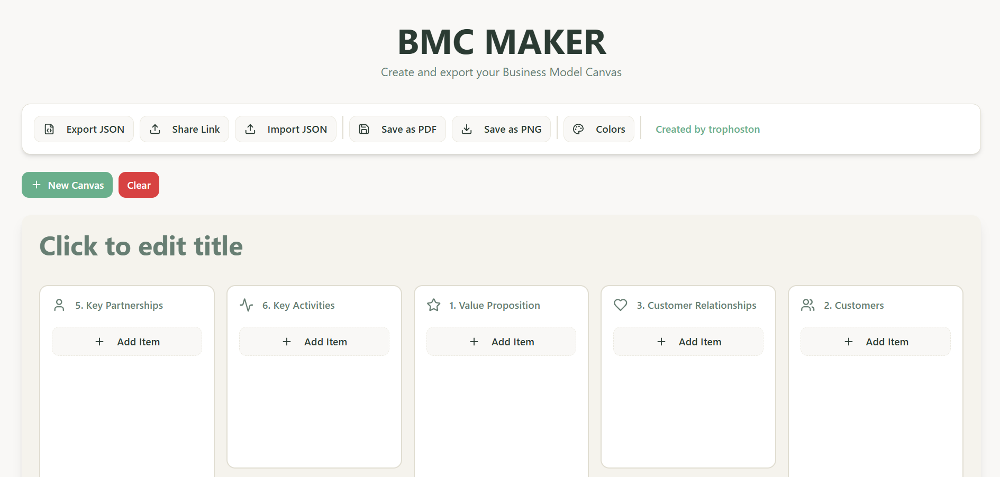
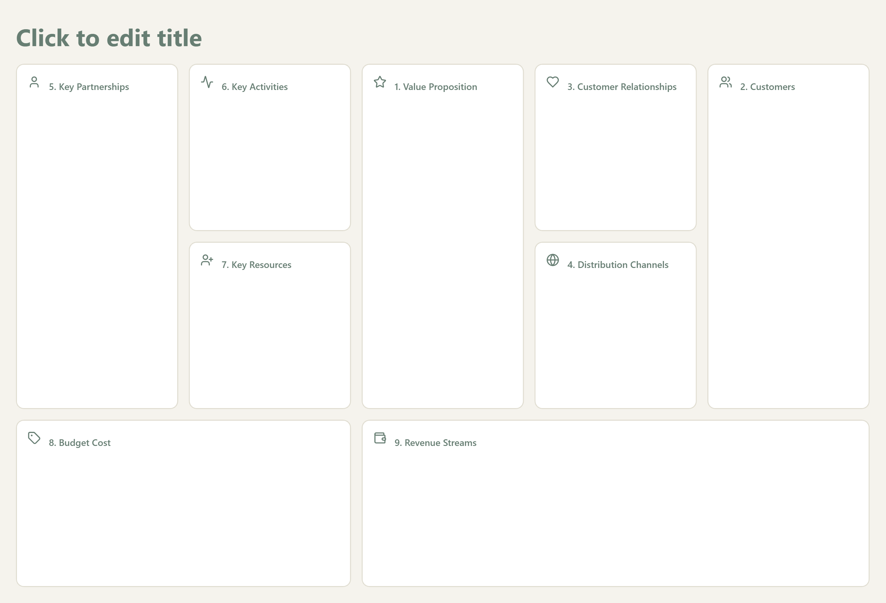

**Online BMC Maker**

A focused, modern editor for building Business Model Canvases quickly and clearly. Use it to prototype business ideas, capture assumptions, and share/export your canvas as an image.



**What this website can do**
- **Create & edit canvases**: Add sections and cards to the standard Business Model Canvas layout and edit their content inline.
- **Arrange visually**: Drag and drop cards to reorganize ideas quickly and see the whole model at a glance.
- **Save & export**: Download your canvas as an image for presentations or attachments, and keep local copies of your work.
- **Fast, responsive UI**: Built with Vite + React + TypeScript for snappy editing on desktop and tablet screens.
- **Small, readable codebase**: Components are organized under `src/` so you can extend or fork the project easily.

**How to use (quick)**
1. Open the editor and start a new canvas.
2. Click a section or the plus button to add a card.
3. Type to edit text, then drag cards to rearrange them.
4. Use the save/export control to download a PNG of your canvas.

**Demo screenshots**
-- **Main editor / Preview**
	
-- **Save / Export preview**
	

**Getting Started**
Clone the repo and install dependencies:

```
git clone https://github.com/Trophoston/Online-BMC-maker.git
cd Online-BMC-maker
npm install
```

Run the development server:

```
npm run dev
```

Build for production:

```
npm run build
```

**Project Structure (high level)**
- **`src/`**: Application source (components, pages, hooks, UI primitives).
- **`public/`**: Static assets and example images used in this README.

**Contributing**
- Fork the repo, create a feature branch, and open a PR. Keep each PR focused and include a brief description of the change.

**Notes & next steps**
- Screenshots in this README reference files in `public/` — they render on GitHub and when running the dev server.
- If you prefer images in `src/assets/` (for bundling or different pathing), I can copy them there and update the README to use those paths.

**License**
- MIT

---

Made with care by Trophoston — build clearer canvases faster.

